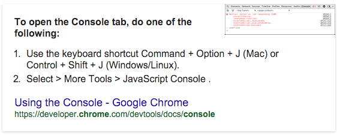
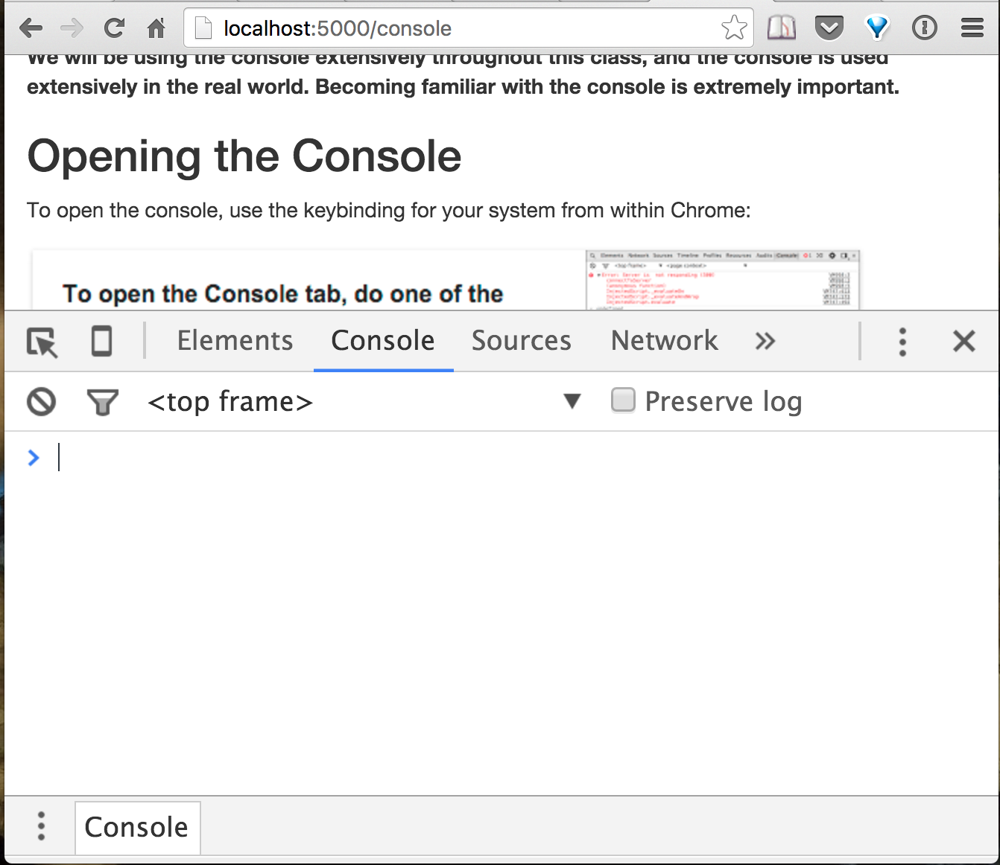
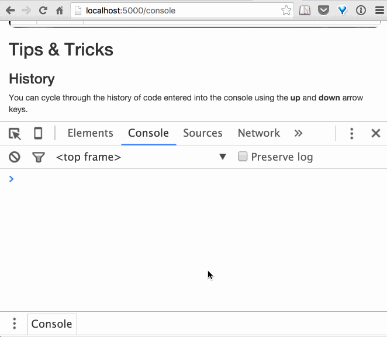

# The Chrome Console

**We will be using the console extensively throughout this class, and the
console is used extensively in the real world. Becoming familiar with the
console is extremely important.**

## The JavaScript Environment

JavaScript is one of the three languages (and the only programming language)
that power web pages on the Internet. We use a web browser, such as Internet
Explorer, Mozilla Firefox, and Google Chrome to view the content on the web
pages. Because web browsers are the tool in which web pages are presented, part
of a web browser's functionality includes running JavaScript. In fact, the most
common (however, not only) environment for running JavaScript is a web browser.

## Google Chrome

In this class, we'll be using Google's Chrome browser which can be downloaded
[here](https://www.google.com/chrome/browser/desktop/). Chrome comes with a
nifty set of tools to help develop web pages, one of which is the JavaScript
console. Google Chrome's developer console can be used to write and execute
JavaScript code, and is a great place to experiment with the language.

## Opening the Console

To open the console, use the keybinding for your system from within Chrome:

It is recommended that you learn to open the console from the keyboard, because
we will be using it so frequently.

When you have the console open, it should look something like this:

## Tips & Tricks

### History

You can cycle through the history of code entered into the console using the
**up** and **down** arrow keys.

