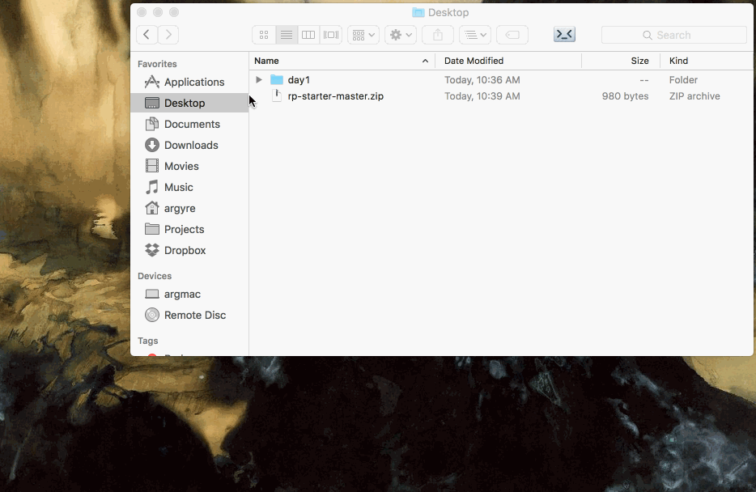

# Getting Started with Sublime Text

## Introduction

The console is a great tool for experimentation, and we are going to continue to
use it throughout the class; however, it has some limitations:

1. **Ephemeral:** All the code you enter into the console goes away! There's no
   way to keep it around after you close your browser, and no way to refer
   back to something you wrote a while ago. When your programs get bigger, this
   won't work.
2. **Poor Editing Capability:** The console is not very good at helping you to
   write code that spans multiple lines, as we soon will. We need something with
   better editing capabilities.

First, if you haven't yet installed a text editor like
[Sublime Text 3](http://www.sublimetext.com/3), now is the time. Do this before moving on.

## Starter Project

We provide a starter project that you can use for most days' exercises. You can
get it by following these instructions:

[Right click here](https://github.com/hackreactor/reactorprep-starter/archive/master.zip
and select "Save Link As..." to save the archive somewhere, *e.g* your desktop.

Next, unarchive the folder inside (can usually be done by just double-clicking)
and open the folder for the current day's project.

Now, complete the following steps:

2. Open that day's JavaScript file in Sublime Text (you may need to right click).
   You should see the following in the file:
   ```js
   function square(x) {
     return x * x;
   }
   ```
3. Open that day's HTML file in Google Chrome (you may need to right click and
   "Open With..."). You should see a page open in your browser that says
   **Welcome!** at the top.
4. Open a console in the **Welcome** HTML page. Type `square(10)` into the
   console and hit Enter -- 100 should be the result. If so, everything's
   working!


